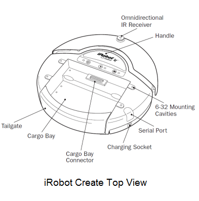
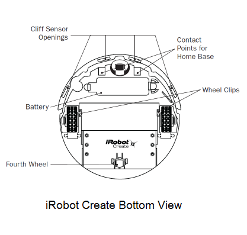
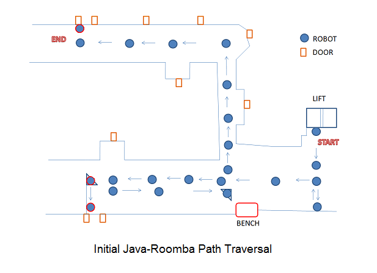
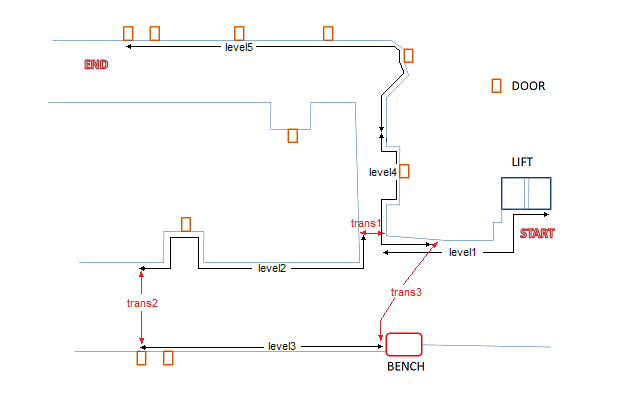
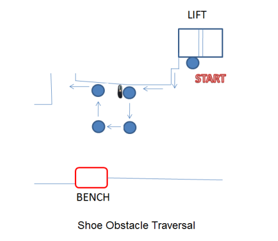
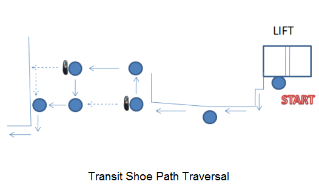
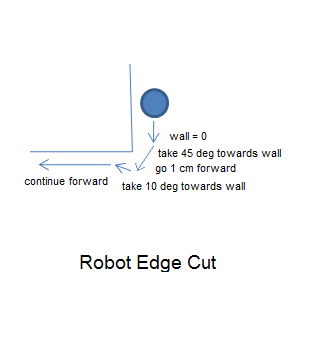
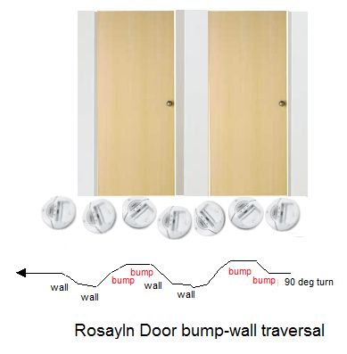
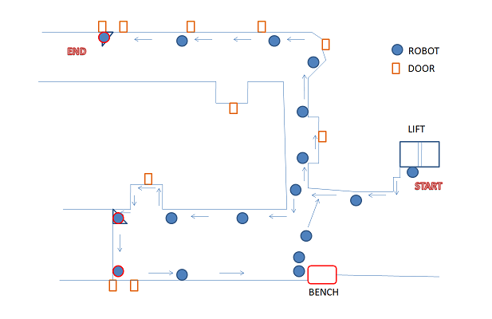

# AI Robotics - Rommba Robot Navigation Project (May 2010)

In AI Robotics class under [Dr M Silaghi](http://cs.fit.edu/~msilaghi/) we had a project which require the robot to trace the passage in second floor, [Harris Center at Florida Tech](https://hiai.fit.edu/). The aim was to program the iRobot create by planning its path and to taking a plate of cookies from Rosalyn's office to Dr Stansifer's office(Room 210) with three unknown obstacles introduced at any point along its route. The starting position of the robot was right in front of the 2nd floor lift door and the end position is perpendicular to Dr Stansifer's door. It was also required to map the computer science corridor and account for eventual bumping of robots with each other and compete with each other to achieve the objective.

## About iRobot Create

[iRobot Create](http://store.irobot.com/shop/index.jsp?categoryId=3311368) is a complete robot development kit that allows one to program new robot behaviors without any worries about mechanical or assembly level details. The iRobot Create's Open Interface (OI) provides with a set of commands, such as "drive" commands, demo commands, song commands and sensor commands, to carry out various actions with the robot mainly path traversal. The [iRobot Create manual](http://www.irobot.com/filelibrary/create/Create%20Manual_Final.pdf) contains all the information regarding its parts and various commands.

The iRobot Create contains 4 sensors, 2 being the bump sensors, 1 is the wall sensor which is located on the right hand side of the robot and lastly the virtual wall which creates a virtual wall using the infrared sensor on the top of the iRobot. It has two main mechanical wheels driving the robot while other two dummy wheels to provide support to the robot. The robot is provided with a serial port connector in order to communicate with the robot using a serial cable from a computer. Also bluetooth can be used to communicate with the robot which could be attached to the cargo connector.

There are many packages to run the iRobot create. [RoombaComm](http://hackingroomba.com/code/roombacomm/) is the java version of the package which we tried for the first time in initial stages. The older python version which was used by the last batch in 2008 was successful because of the far more vital wall sensor. Also there is a [CSharp version](http://sourceforge.net/projects/roomba-term/) of package to drive the iRobot Create but is not tested by us until date.

## Initial development with Roombacomm java API (Milestone 1)

Initially we used the [RoombaComm 0.96 package](http://sourceforge.net/projects/roomba-term/) to drive the robot. The initial program was simple as we used the RoombaCommSerial class in the Roombacomm package which extended the Abstract class RoombaComm. The RoombaComm provided all the basic set of methods with their implementation given as follows.

| No | Method	      | Description |
|----|--------------|------------:|
| 1  | connect	    | Used to estabish a serial connection to the specified port |
| 2  | startup	    | Used to initialize the robot |
| 3  | contro       | Used to send the control command to the robot inorder to power the robot and operate in safe mode. |
| 4  | paus         | Used to pause the motion of the robot before executing the next command, similar to sleep for a program |
| 5  | updatesensors| Used to query and synchronize the sensor status of the robot with the program |
| 6  | poweroff	    | Turns the power off of the robot which could only be waked up by calling the wakeup function. |
| 7  | playNote	    | Plays a musical note from note number from 31 (G0) to 127 (G8) for the speicified duration. If another note is played before one is finished, the new note cuts off the old one. |
| 8  | spin	        | Spin right or spin left a particular number of degrees, negative value indicates right while positive indicates left. |
| 9  | spinLeft	    | Spin left at a specified speed with a specified angle in degrees always positive. |
| 10 | spinRight   	| Spin Right at a specified speed with a specified angle in degrees always positive. |
| 11 | goStraight	  | Move forward at a specified speed until the specified distance in millimeters always positive. |
| 12 | goForward	  | Move forward at a specified speed until the specified distance in millimeters always positive. |
| 13 | goBackward	  | Move backwards at a specified speed until the specified distance in millimeters always positive. |
| 14 | bump       	| Detect whether there is a right or left bump or both and whether there is a wall in front of the robot. |
| 15 | stop	        | Stop Rooomba's motion |

Before running the robot code using roomba package, one must copy the " roombacomm\rxtxlib\rxtxSerial.dll " file in current JVM or JDK bin directory. To compile the program we used the command "javac -classpath .;rxtxlib/RXTXcomm.jar roombacomm/program.java" while to execute the program the command is as below: "java -classpath .;rxtxlib/RXTXcomm.jar; roombacomm.program". The robot is set to operate in safemode inorder to ensure that safety related features are active preventing accidents.

About the actual logic of the our implementation, we measured the distances until the turns, counter adjusted the robot rotation due to minor deviation and try to increase the speed in some cases in order to avoid bumps. But as we all know that we don't live in a perfect world and hence the robot strays away from his path and bumps on to the wall majority of times. So inorder to handle bumps the program logic was altered such that the main method will spawn a thread which would initiate the serial set of commands for the robots traversal. The main thread in turn continues to update with the sensors and checks whether there are any bumps (right, left or both). For every bump kind of bump we had a particular fixed handling eg. for right bump turn left 45 deg, left turn right 45 deg, and for center go back and turn right 90 deg as it applied to most of the cases except the at the later stages. This caused unpredicted movement of the robot after bump with higher possiblity of straying from its path. As the code was sequencial set of commands intented to traverse the whole path in one go, it became very diffcult to handle several cases. It was then we decided to divide the code into small fragments called levels (22 in total), each fragment representing a single motion in particular direction neglecting the angular rotations. A flag was used to update the current level in progress to the main thread inorder to handle bumps and carry out appropriate actions for each level. But the question was how would one thread interrupt the other thread execute its code and then allow the interrupted thread to continue. This was solved by synchronized wait loop given below followed by the command to be executed.

      synchronized (this) {
       while (pleaseWait) {
        try { wait(); } catch (Exception e) { }
       }
      }

Here pleaseWait is the flag set to false when bump recovery code execution is in progress else is true. Also the functions or commands called by the traversal thread are modified to call the local custom functions preceded by the wait loop above, following the original functioncall. But it turned out that after the action taken by bump handling code, the next command is executed causing the remaining distance in a level left untravelled. To account for such distances, a global distance and time parameter was taken, and updated with start time of the level. In case of bump, the main thread used the start time and current time to calculate the previous distance covered, subtracted from the global distance for each level set by the traversal thread to get the remaining distance needed to be covered after the bump recovery.

After uneven handling of bumps and decreasing the angle of turn to 15 degrees for left, right and center bumps preceded by 10mm backward motion, it became clear that it would be hard to handle each and every case at every level precisely. The counter measure was to record all the previous moves and determine the linear distance from the start point to current location, current angular deviation, required angle for the current level in order to take bump recovery actions with more precsion. Another simpler approach would have been to stray away with a predetermined distance and adjust the extra distance and realign the robot to previous angle before bump. But due to the scarcity of sensors on the robot and with wall sensor not working using the RoombaComm package it would still have been diffcult to determine on the wall on which the robot bumped. Also as the project involved multiple unknown obstacle bumps, the complexity of the solution would have been increased in absence of a third sensor. Hence it was decided to move on to the Python package of iRobot Create which also detects the wall at the right hand side of the robot. [Refer RoboMain.java](Robomain.java).

## Python iRobot Create Package

The python iRobot Create package consists of a suite of following softwares compatile with Windows Vista and Windows 7:

    1. [Python 2.6.5](http://python.org/download/)
    2. [Pyserial 2.5-rc2 for windows](http://sourceforge.net/projects/pyserial/files/)
    3. [Pywin32-214 (win32all package)](http://sourceforge.net/projects/pywin32/files/)
    4. [pyCreate API](http://www.cs.hmc.edu/~dodds/erdos/pyCreate.zip)

The python development was carried in its inbuilt development environment called the [IDLE](http://docs.python.org/library/idle.html). Being new to the python langauge, we faced problems with the matching identations which require to be precise. Also as the variables in python are declare and use without data types, added up to the problems in execution. To run the program in python one needs to import the pyCreate package which is in the same location as that of the program and call the function which needs to be executed after their definition. The whole API used for python revolved around go(cm/sec, deg/sec) with some occasional playSong(sequence of playnotes) inorder to test the code. In the initial function which acts as main, we initantiate the class Create by passing the port number to which the serial cable is connected. Then we set the robot to move in fullmode using the function toFullMode() inorder to get an unrestricted control of the robot. At the end stop() function is called which inturn calls go(0,0) in order to stop the robot. The function sensors() is used to get the array of the current state of the sensors such as create.DISTANCE, create.LEFT_BUMP, create.RIGHT_BUMP, create.WALL_SIGNAL were create is the name of the class. The create.DISTANCE gives the distance covered since the last call to the sensors(), create.LEFT_BUMP returns 1 if case of left bump else returns 0, similarly for the create.RIGHT_BUMP. Finally create.WALL_SIGNAL returns the strength of the signal from the wall. Another important function we use throughout the program is time.sleep(secs) which suspends the execution for specified number of seconds, allowing the robot to move with previously set up linear speed and angular speed or pause for a while. An important think to note here is that the pyCreate package makes use of threads which executes for inifinite time until the main function terminates. One can just change the speed of the robot or pause the next command in current function without determing the exact distance to move directly. Hence python operates mainly with the velocity settings and regular pauses, while previous java-roombacomm operates by using direct distances and angles to be taken.

## Struggle of Milestone 2

As discussed earlier, inorder to gain advantage of having a third sensor i.e. the right wall sensor and handle bumps efficiently the development was shifted to python package from java. We reviewed the previous year's project code to understand the bump recovery techniques and handling the robot to trace the wall maintaining the distance of in python. The value from the create.WALL_SIGNAL is proportional to the strength of the signal which in turn determines the closeness to the wall. When the value of the signal reaches zero, we say right wall is disappeared. In order for the robot to trace the wall we need to lean the robot towards the wall by 15 deg when signal strength reduces to 40 or less, while we lean away by 15 deg from the wall when the signal strength increases to 59 or more.

Further we decided the levels based on the continous sequence of wall, seperated by transits or by critical edges as between level 4 and level5. The initial code of level 1 turns the robot by 90 deg right, goes forward until it bumps the left side of the elevator setting the flag to 1, thus enabling the wall traversing code. To overcome the consecutive edges it goes forward, and after having a right bump, turns 15 degree and iterates the process until no bump. When no bump is detected the wall traversing codes enables to trace the wall. After the end of edges and start of the straight wall detected using pre-caliberated distance, every center bump (i.e. both right and left bump) is treated as a shoe bump unless the distance is greater than the pre-specified distance from start to ending edge of level1. The sequence of actions for a shoe bump which is the random obstacle is to go back by 5cm, take 90 left, go for 30cm, take 90 right, go 30cm, take 90 right, go 30cm and finally take 90 left choosing a square form of path inorder to avoid the obstacle as shown in the figure below.

Now the distance plays a key role in determining the shoe bump or accidental wall bump, so they need to be adjust precisely with minmum distance to complete the level selected. The dilemma in such a case will be if the wall is traversed in maximum distance then level 1 code continues to execute in the actual transit 1 path, causing the bumps in the transit handled in the same manner as in level 1. Further such an obstacle handling mechanism works only for one or two shoes, in case an obstacle is bigger than 30cm such as a CPU Cabinet or a Garbage Can then this mechnism fails. Also it should be noted that none of the obstacle works when the shoe bump handling path is traversed. Such shoe handling mechanism applied to all the parts of the path with no doors, edges or corners along the wall.

We then move on with the handling of bumps in transit from one level to another. When the robot is center bumped in between the transit such that the distance is not yet equal to the minimum distance to cross transit1, it detects that it is a shoe and recedes 9cm back, takes 90 deg right, goes for 50 cm, takes 90 deg left, goes 7cm forward and continues to move forward until there is another shoe bump or it bumps the wall. In case of another shoe bump, the robot moves 50 cm in an opposite direction which is left in this case. This causes the robot to stray away from its path to maximum of 50 cm regardless of number of bumps which is recorded as deviation, a parameter returned by the transit function to the next level inorder to add extra distance in case of odd number of bumps. The dotted line in the figure of transit shoe path traversal shows the motion of the robot, had there been no such shoe (center) bump. Once the distance exceeds the minimum distance to cover transit 1 then the next center bump is considered as the wall, causing the robot to take left by 90 deg and transferring the control to next level. Such a mechanism is attached to all the transits inorder to avoid random shoe obstacles. Again, when distance is travelled in maximum compared to the minimum distance, a shoe bump might be considered as the end wall or (Rosayln door in case of trans2). Further any bumps given to the robot while the shoe bump recovery are unaddressed causing adrupt behaviour of the robot.

    

Edges are handled by in a predetermined manner in which distance plays a key role. When the distance is less than the level distance or some milestone distance and wall signal becomes zero then it is termed as an edge. In order to go passed an edge a 45 deg angle towards wall (right) is taken, followed by a small motion, then taking 10 deg right towards the wall and moving forward in order to escape the edge. The problem emerges once a shoe is placed on an edge causing confusion, making the shoe as a wall, then later detecting tip of the shoe as edge, turning towards the shoe as before pretending it as an edge, and stucking up to the wall or causing other bumps making it move adruptly. The quad which is an entry to the Phd lab is traversed using the predertermined number of center bumps which is 2 and number of edges which are 3 in total for level 2, making it easy to traverse. It also acts as a milestone, such as the last edge just before the turn to the Rosalyn's door enables to adjust the distance, even if the prior distance is erroneous due to uneven bumps or obstacles.

The Rosayln's door traversal along with the Tech Support lab door is one of the important phase of development. Doors are not traversed based on its distance which is 1000mm, nor the number of edges traversed, but based on bump-wall traversal tachnique. In this technique, for every bump the robot takes an opposite angle of 15 deg depending on whether there is left or right bump. As soon as bumping is over the robot moves away from the door/wall making wall signal equal to zero, thus executing the wall zero code. When wall signal is zero the robot moves slows its speed to 10cm/s and keeps taking an angle of 25 deg after a period of 1.02 secs, thus causing the robot to come again near to the door/wall and bump it. This process continues until the doors are traversed using the minimum distance of 2800mm. In order to start counting the distance along the wall and enable the shoe obstacle traversal mechanism, a wallsmooth counter is used to check the number of times the wall is traced such that the wall signal is non-zero. Hence in the straight wall we employed the shoe traversal code in order to avoid the shoe obstacles. Once a minimum distance of 5700mm is reached after wall smoothing the center bump is considered as the bench near the elevator and the robot takes 90 degree turn exiting level3. The major problem with level3 was to detect the exact smoothing of the wall (especially cases in which obstacles are placed near the door), which shortened the distance between the robot and the bench. More bumps before smoothing causes the center bump of the elevator bench to be treated as a shoe bump, making unexpected traversals. On other hand, if the straight wall distance after smoothing to reach the elevator bench is increased, and if no obtacles were placed before smoothing or less bumps occurred, then shoe bumps near the elevator bench were considered as the bench itself, disrupting the whole path. As in the later section you will see that such problems were solved by fine tuning, assumptions and probability of bumps.

## Continuing with Milestone 3

As until now milestone 2 was never presented individually, by covering milestone 3 reaching the end of the path. The highlights of milestone 3 were the transit3 traversal, women's bathroom problems, breakroom turn etc. As discussed in milestone 2, when the robot reaches the elevator bench it takes a 90 degree turn and calls the function transit3. Initially, transit3 moved the robot forward until a fixed distance is reached and then turned it to an angle of 30 degree. Later the robot moves forward until it bumps the elevator wall along with the transit shoe path traversal mechanism attached. The trouble was, in the real world the 90 degree taken by the robot in level3 was never perfect, causing irregular forward motion disrupting the transit path. So the code was modified such that the robot doesn't just move forward but traverses the edge of the bench simultaneously. Once the wall signal becomes zero i.e. the edge of the bench is over, the robot moves forward until the total distance is 639mm and the wall zero value is 11. The wall zero value indicates the number of times wall zero signal has been received. If the robot encounters a bump to the edge of the bench, the robot tries to align itself to the edge and sets a flag indicating bench bump. If there is no bench bump, the angle taken by the robot is 40 degree clockwise else it is 45 degrees. After taking the initial tilt, the robot follows the same mechnaism as transit1 and 2. Only the distance to reach the endpoint is changed to 2770 (in case of odd shoe bumps) or 1850 (in case of even or no shoe bumps), alongwith the final angle taken by the robot towards left which is 110 degrees. [Refer Robodemo.py](Robodemo.py).

## Final Day

Below shows the path of the robot based on the Rosalyn bump-wall technique applied to level 2, 3, 4 and 5 making it rough and tough for handling dynamic obstacles and maintaining its path along the wall. [Refer Robofinal.py](Robofinal.py)

